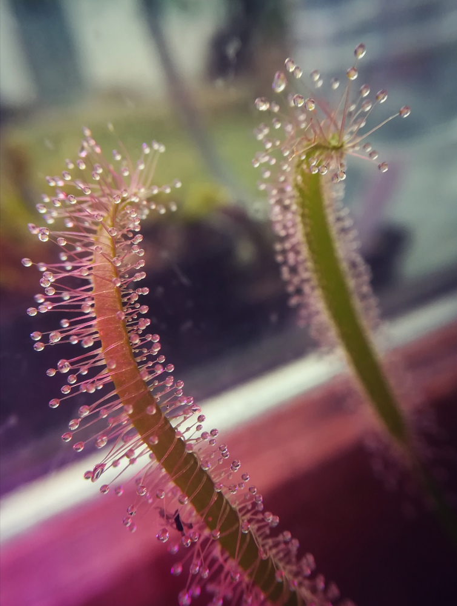
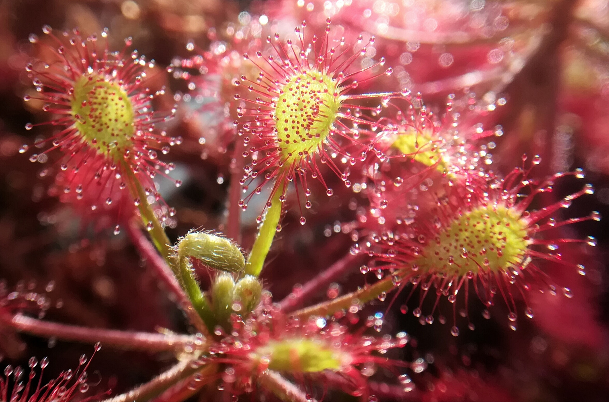
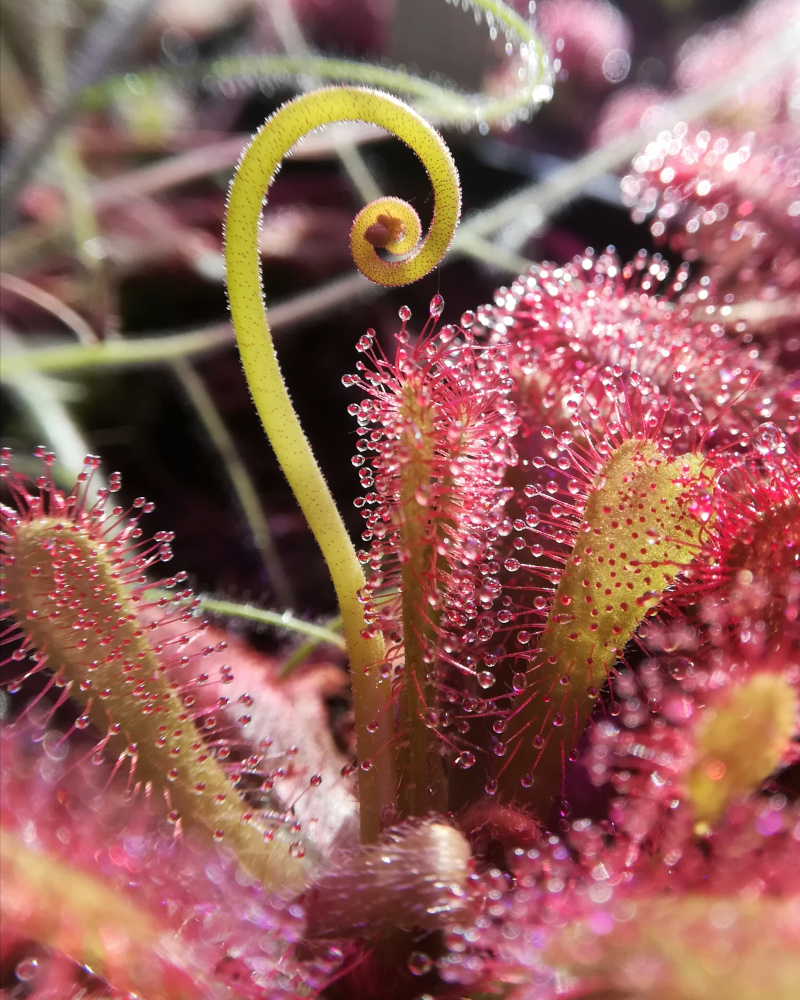

```{r setup, include=FALSE}
knitr::opts_chunk$set(echo = TRUE)
```

## Description
`drosera` is a data package that provides a botanical replacement dataset for Anderson and Fisher's famous `iris` dataset that is free from its troublesome past. It is based on a set of plants that I am growing on my windowsill which I measured with a caliper in a matter of a couple of hours to have an example dataset for the [`corrmorant`](https://github.com/r-link/corrmorant) package and is entirely devoid of scientific rigor. However, I believe it is a useful example dataset that will hopefully enable some people to replace `iris` in their code and package documentation, and maybe even spark an interest in carnivorous plants in a couple of R users.

The dataset contains 150 observations of leaf and petiole size for five varieties of three African sundew species: the typical and red forms of _Drosera capensis_ (left), the typical form of _Drosera madagascarienis_ (center) and the typical and anthocyanin-reduced forms _Drosera venusta_ (right). 

<br></br>


 


<br></br>

It is published under a [Creative Commons Zero license](https://github.com/r-link/drosera/blob/master/LICENSE), so it is free to use in any kind of commercial or non-commercial setting. In particular, if you need a replacement dataset for `iris` for the examples in your R package, feel free to add `drosera` to the package without any additional precautions.

However, it would be kind if you add a link to the package's [Github page](https://github.com/r-link/drosera) in case you decide to use it (and maybe drop me a line so I can link your project in the repository), but I won’t be mad if you don’t.


[_Drosera_](https://en.wikipedia.org/wiki/Drosera) is a wide-spread genus of carnivorous plants (around 200 species) in the family Droseraceae that catch their (mostly insect) prey with a sticky trap mechanism based on a mucilaginous secretion from stalked glands covering their leaf surface. The glistering drops of mucilage on their tentacle-like glands have earned them the common name sundews. 


## Usage
The `drosera` data package can be installed from Github using `remotes::install_github()`:

``` {r, eval = FALSE}
# install remotes package if necessary
install.packages("remotes")
# install corrmorant from the github repository
remotes::install_github("r-link/drosera")
```

Afterwards, the package can be loaded regularly via `library()` to access the data:
``` {r}
library(drosera)
data(package = "drosera")
```

Afterwards, the `drosera` data can be used as a regular loaded dataset:
``` {r}
head(drosera)
```

The dataset shows strong correlations between the different variables, and pronounced inter- and intraspecific differences. Here's an illustration based on the  [`corrmorant`](https://github.com/r-link/corrmorant) package.

```{r, message = FALSE, fig.width = 7, fig.height = 7}
# load packages
library(tidyverse)
library(corrmorant)

# create plot
ggcorrm(drosera,                                 # dataset
        aes(color = species, fill = species),    # settings of non-standard aesthetics: color and fill by species
        rescale = "as_is",                       # no rescaling
        labels = paste(str_to_sentence(gsub("_", " ", names(drosera)[3:6])), "(mm)")) + # labels for variable names
  lotri(geom_point(alpha = 0.4)) +               # points in lower triangle 
  utri_corrtext() +                              # indicator of (Pearson) correlation in upper triangle
  dia_density(lower = .4, color = "black", size = .3, alpha = .5) + # density plots on the plot diagonal
  dia_names(y_pos = .2) +                        # variable names on the plot diagonal
  scale_color_viridis_d(option = "C", begin = .1, end = .9,  # color scale settings
                        aesthetics = c("fill", "color"))


```


