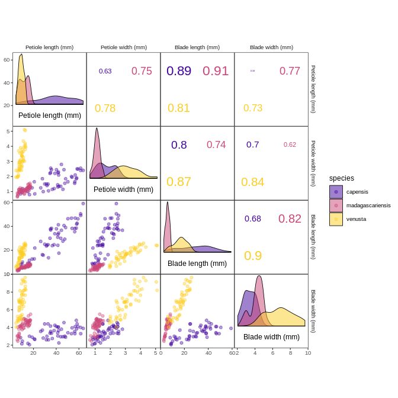

drosera: Leaf And Petiole Size For Three African Sundew Species
================
Roman M. Link

## Description

`drosera` is a data package that provides a botanical alternative for
Anderson and Fisher’s famous `iris` dataset which is free from its
troublesome past (see e.g. [this blog post on Armchair
Ecology](https://armchairecology.blog/iris-dataset/) and [this great
Twitter thread by Macyclare
Griffin](https://twitter.com/mcmcgriffin/status/1271940745193275393)).
It is based on a set of plants that I am growing on my windowsill which
I measured with a caliper in a matter of a couple of hours to have an
example dataset for the
[`corrmorant`](https://github.com/r-link/corrmorant) package and is
entirely devoid of scientific rigor. However, I believe it is a useful
example dataset that will hopefully enable some people to replace `iris`
in their code and package documentation, and maybe even spark an
interest in carnivorous plants in a couple of R users.

The dataset contains 150 observations of leaf and petiole size for five
varieties of three African sundew species: the typical and red forms of
the Cape sundew, [*Drosera
capensis*,](https://en.wikipedia.org/wiki/Drosera_capensis) (left), the
typical form of [*Drosera
madagascarienis*](https://en.wikipedia.org/wiki/Drosera_madagascariensis)
(center) and the typical and anthocyanin-reduced forms of [*Drosera
venusta*](https://en.wikipedia.org/wiki/Drosera_venusta) (right, photos
taken by myself). 

It is published under a [Creative Commons Zero
license](https://github.com/r-link/drosera/blob/master/LICENSE), so it
is free to use in any kind of commercial or non-commercial setting. In
particular, if you need a replacement dataset for `iris` for the
examples in your R package, feel free to add `drosera` to the package
without any additional precautions.

However, it would be kind if you add a link to the package’s [Github
page](https://github.com/r-link/drosera) in case you decide to use it
(and maybe drop me a line so I can link your project in the repository),
but I won’t be mad if you don’t.

[*Drosera*](https://en.wikipedia.org/wiki/Drosera) is a wide-spread
genus of carnivorous plants (around 200 species) in the family
Droseraceae that catch their (mostly insect) prey with a sticky trap
mechanism based on a mucilaginous secretion from stalked glands covering
their leaf surface. The glistering drops of mucilage on their
tentacle-like glands have earned them the common name sundews.


## Usage

The `drosera` data package can be installed from Github using
`remotes::install_github()`:

``` r
# install remotes package if necessary
install.packages("remotes")
# install corrmorant from the github repository
remotes::install_github("r-link/drosera")
```

Afterwards, the package can be loaded regularly via `library()` to
access the data:

``` r
library(drosera)
data(package = "drosera")
```

Afterwards, the `drosera` data can be used as a regular loaded dataset:

``` r
head(drosera)
```

    ##    species variety petiole_length petiole_width blade_length blade_width
    ## 1 capensis   rubra          54.00          1.95        38.30        3.95
    ## 2 capensis   rubra          45.90          1.15        27.60        2.95
    ## 3 capensis   rubra          21.20          0.85        21.85        2.65
    ## 4 capensis   rubra          56.40          1.65        38.20        3.30
    ## 5 capensis   rubra          28.60          1.00        15.80        2.80
    ## 6 capensis   rubra          32.85          1.50        24.65        4.40

## Examples for visualizations with corrmorant

The dataset shows strong correlations between the different variables,
and pronounced inter- and intraspecific differences. Here’s a basic
illustration based on the
[`corrmorant`](https://github.com/r-link/corrmorant) package.

``` r
# load packages
library(tidyverse)
library(corrmorant)

# create plot
ggcorrm(drosera,                                 # dataset
        aes(color = species, fill = species),    # settings of non-standard aesthetics: color and fill by species
        rescale = "as_is",                       # no rescaling
        labels = paste(str_to_sentence(gsub("_", " ", names(drosera)[3:6])), "(mm)")) + # labels for variable names
  lotri(geom_point(alpha = 0.4)) +               # points in lower triangle 
  utri_corrtext() +                              # indicator of (Pearson) correlation in upper triangle
  dia_density(lower = .4, color = "black", size = .3, alpha = .5) + # density plots on the plot diagonal
  dia_names(y_pos = .2) +                        # variable names on the plot diagonal
  scale_color_viridis_d(option = "C", begin = .1, end = .9,  # color scale settings
                        aesthetics = c("fill", "color"))
```

    ## The following column names were replaced:
    ## petiole_length   ->  Petiole length (mm)
    ## petiole_width    ->  Petiole width (mm)
    ## blade_length ->  Blade length (mm)
    ## blade_width  ->  Blade width (mm)

<!-- -->

The patterns become even clearer when assessed on a log scale:

``` r
drosera %>% 
  mutate_if(is.numeric, log) %>% 
  ggcorrm(
    aes(color = species, fill = species),   
    labels = paste(str_to_sentence(gsub("_", " ", names(drosera)[3:6])), "(mm)")) + 
  lotri(geom_point(alpha = 0.4)) +              
  utri_corrtext() +                              
  dia_density(lower = .4, color = "black", size = .3, alpha = .5) + 
  dia_names(y_pos = .2) +                        
  scale_color_viridis_d(begin = .15, end = .85, aesthetics = c("fill", "color")) 
```

    ## The following column names were replaced:
    ## petiole_length   ->  Petiole length (mm)
    ## petiole_width    ->  Petiole width (mm)
    ## blade_length ->  Blade length (mm)
    ## blade_width  ->  Blade width (mm)

<!-- -->

Notably, for the two species where different varieties were measured,
there are also subtle but notable differences between the distinct
forms:

``` r
# Function for plots
pfun <- function(data){
  ggcorrm( data,
    aes(color = variety, fill = variety), 
    bg_dia   = "grey20",
    bg_lotri = "grey40",
    bg_utri  = "grey40",
    labels = paste(str_to_sentence(gsub("_", " ", names(drosera)[3:6])))
  ) + 
    lotri(geom_smooth(alpha = .3, method = "lm", size = .35)) +
    lotri(geom_point(alpha = .65)) +              
    utri_corrtext(ncol = 1, squeeze = .3) +        
    dia_density(lower = .3, alpha = .5) +
    dia_names(y_pos = .15, col = "#DDDDDD") +  
    theme(panel.border    = element_rect(fill = NA, color = "#DDDDDD", size = .8),
          legend.background = element_blank(),
          plot.background = element_rect(fill = "#DDDDDD", , color = "#DDDDDD"),
          plot.title = element_text(face = "italic", hjust = 0.5, size = 15)) 
}

# Create plot for Drosera capensis 
capensis <- pfun(filter(drosera, species == "capensis")) +     
    scale_color_manual(values = c("#BB4456", "#25BB04"), aesthetics = c("color", "fill"),
                       name = "Variety") +
    ggtitle("Drosera capensis") 

# Create plot for Drosera venusta
venusta <- pfun(filter(drosera, species == "venusta")) +     
  scale_color_manual(values = c("#88FF96", "#25BB04"), aesthetics = c("color", "fill"),
                     name = "Variety") +
  ggtitle("Drosera venusta") 

# Combine both plots using cowplot::plotgrid()
cowplot::plot_grid(capensis, venusta, nrow = 1) +
  theme(plot.background = element_rect(fill = "#DDDDDD", color = NA))
```

<!-- -->

You can clearly see that for *Drosera capensis*, the plants of the red
form have notably more slender leaves and petioles than the typical
form. For *Drosera venusta*, the differences in proportions were less
pronounced, but the plants of the anthocyanin-reduced form on average
are smaller than the plants of the typical plants.
